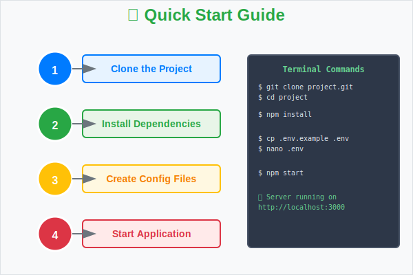

# 🚀 始め方



このガイドでは、プロジェクトを開始するための手順を説明します。

## 前提条件

- Node.js 18.0 以上
- Git がインストールされていること

## クイックスタート

### 1. プロジェクトのクローン

```bash
git clone https://github.com/your-repo/project.git
cd project
```

### 2. 依存関係のインストール

```bash
npm install
```

### 3. 設定ファイルの作成

詳細な設定については [設定ページ](./060-configuration.html) を参照してください。


## 次のステップ

セットアップが完了したら：

- [アーキテクチャ](./040-architecture.html) でシステム構造を理解する
- [API仕様](./050-api-reference.html) でAPIの使い方を学ぶ
- [ユーザーガイド](./080-user-guide.html) で基本操作を習得する

問題が発生した場合は [トラブルシューティング](./090-troubleshooting.html) を確認してください。

---

## ナビゲーション

- [🏠 ホーム](./010-README.html)
- [📋 概要](./020-overview.html)
- [⚙️ 設定](./060-configuration.html)
- [❓ FAQ](./100-faq.html)
