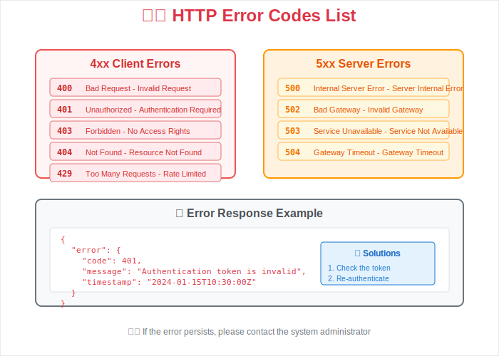

# 🔧 API Specification


This document describes the detailed specifications of the REST API.

## Base URL

```
https://api.example.com/v1
```

## Authentication

All API endpoints require authentication with a JWT token.

```http
Authorization: Bearer {your-jwt-token}
```

## Endpoint List

### User Management

#### GET /users

Retrieves a list of users.

```http
GET /users
```

**Response Example:**

```json
{
  "users": [
    {
      "id": 1,
      "name": "John",
      "email": "john@example.com"
    }
  ]
}
```


#### POST /users

Creates a new user.

```http
POST /users
Content-Type: application/json

{
  "name": "Jane",
  "email": "jane@example.com"
}
```

### Data Management

For detailed data management methods, please refer to the [Developer Guide](./070-developer-guide.md).

## Error Handling

For details on API errors, please see [Troubleshooting](./090-troubleshooting.md#api-errors).



---

## Navigation

- [🏠 Home](./010-README.md)
- [🏗️ Architecture](./040-architecture.md)
- [👨‍💻 Developer Guide](./070-developer-guide.md)
- [🔧 Troubleshooting](./090-troubleshooting.md)
