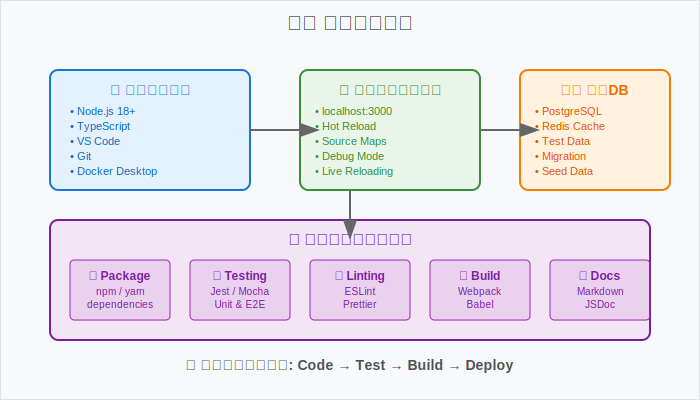
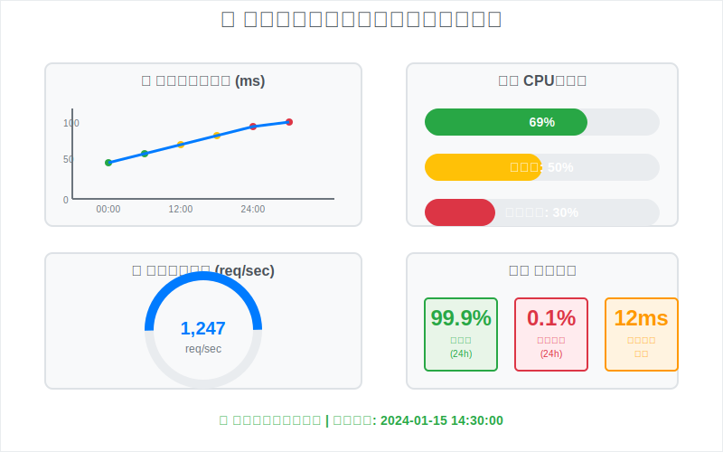

# 👨‍💻 開発者ガイド


このガイドでは、開発者向けの詳細な技術情報を提供します。

## 開発環境のセットアップ

基本的なセットアップは [始め方](./030-getting-started.html) を参照してください。

### 追加の開発ツール

```bash
# 開発用依存関係のインストール
npm install --dev

# テストの実行
npm test

# 開発サーバーの起動
npm run dev
```



## コードスタイル

### TypeScript設定

```typescript
// tsconfig.json
{
  "compilerOptions": {
    "strict": true,
    "target": "ES2020",
    "module": "commonjs"
  }
}
```

## API開発

詳細なAPI仕様は [API仕様](./050-api-reference.html) を参照してください。

### データ管理API

カスタムAPIエンドポイントの作成方法：

```typescript
// カスタムエンドポイントの例
app.get('/api/custom', (req, res) => {
  // 実装コード
});
```

## パフォーマンス最適化



### キャッシュ戦略

- Redis によるセッションキャッシュ
- CDN による静的リソース配信

詳細なアーキテクチャは [アーキテクチャ](./040-architecture.html) をご覧ください。

## テスト

```bash
# ユニットテスト
npm run test:unit

# 統合テスト
npm run test:integration
```

## デバッグ

### ログ設定

```typescript
// logger.ts
import winston from 'winston';

const logger = winston.createLogger({
  level: 'info',
  format: winston.format.combine(
    winston.format.timestamp(),
    winston.format.json()
  ),
  transports: [
    new winston.transports.File({ filename: 'error.log', level: 'error' }),
    new winston.transports.File({ filename: 'combined.log' })
  ]
});

if (process.env.NODE_ENV !== 'production') {
  logger.add(new winston.transports.Console({
    format: winston.format.simple()
  }));
}

export default logger;
```

### プロファイリング

```typescript
// performance.ts
export class PerformanceProfiler {
  private startTime: number;

  start(label: string): void {
    this.startTime = performance.now();
    console.time(label);
  }

  end(label: string): number {
    const duration = performance.now() - this.startTime;
    console.timeEnd(label);
    return duration;
  }

  memory(): NodeJS.MemoryUsage {
    return process.memoryUsage();
  }
}
```

## トラブルシューティング

開発中の問題については、以下のリソースを確認してください：

- [API仕様](./050-api-reference.html) でエンドポイントの詳細を確認
- [アーキテクチャ](./040-architecture.html) でシステム構成を理解
- [FAQ](./100-faq.html) でよくある質問を確認

---

## ナビゲーション

- [🏠 ホーム](./010-README.html)
- [🏗️ アーキテクチャ](./040-architecture.html)
- [🔧 API仕様](./050-api-reference.html)
- [📚 ユーザーガイド](./080-user-guide.html)
