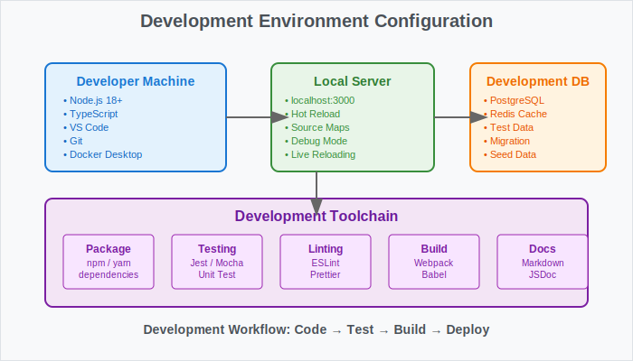

# 👨‍💻 Developer Guide


This guide provides detailed technical information for developers.

## Development Environment Setup

For basic setup, please refer to [Getting Started](./030-getting-started.md).

### Additional Development Tools

```bash
# Install development dependencies
npm install --dev

# Run tests
npm test

# Start development server
npm run dev
```



## Code Style

### TypeScript Configuration

```typescript
// tsconfig.json
{
  "compilerOptions": {
    "strict": true,
    "target": "ES2020",
    "module": "commonjs"
  }
}
```

## API Development

For detailed API specifications, please refer to [API Specification](./050-api-reference.md).

### Data Management API

How to create custom API endpoints:

```typescript
// Example of custom endpoint
app.get('/api/custom', (req, res) => {
  // Implementation code
});
```

## Performance Optimization


### Caching Strategy

- Session caching with Redis
- Static resource delivery with CDN

For detailed architecture, please see [Architecture](./040-architecture.md).

## Testing

```bash
# Unit tests
npm run test:unit

# Integration tests
npm run test:integration
```

## Debugging

### Logging Configuration

```typescript
// logger.ts
import winston from 'winston';

const logger = winston.createLogger({
  level: 'info',
  format: winston.format.combine(
    winston.format.timestamp(),
    winston.format.json()
  ),
  transports: [
    new winston.transports.File({ filename: 'error.log', level: 'error' }),
    new winston.transports.File({ filename: 'combined.log' })
  ]
});

if (process.env.NODE_ENV !== 'production') {
  logger.add(new winston.transports.Console({
    format: winston.format.simple()
  }));
}

export default logger;
```

### Profiling

```typescript
// performance.ts
export class PerformanceProfiler {
  private startTime: number;

  start(label: string): void {
    this.startTime = performance.now();
    console.time(label);
  }

  end(label: string): number {
    const duration = performance.now() - this.startTime;
    console.timeEnd(label);
    return duration;
  }

  memory(): NodeJS.MemoryUsage {
    return process.memoryUsage();
  }
}
```

## Troubleshooting

For issues during development, please check the following resources:

- [API Specification](./050-api-reference.md) for endpoint details
- [Architecture](./040-architecture.md) to understand system structure
- [FAQ](./100-faq.md) for common questions

---

## Navigation

- [🏠 Home](./010-README.md)
- [🏗️ Architecture](./040-architecture.md)
- [🔧 API Specification](./050-api-reference.md)
- [📚 User Guide](./080-user-guide.md)
