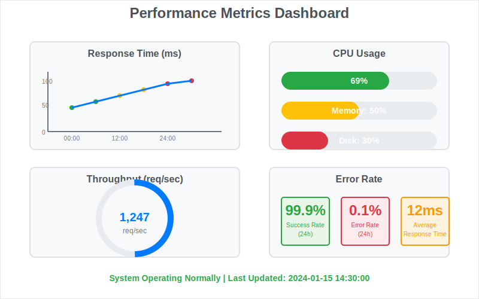

# 👨‍💻 開発者ガイド


このガイドでは、開発者向けの詳細な技術情報を提供します。

## 開発環境のセットアップ

基本的なセットアップは [始め方](./getting-started.md) を参照してください。

### 追加の開発ツール

```bash
# 開発用依存関係のインストール
npm install --dev

# テストの実行
npm test

# 開発サーバーの起動
npm run dev
```


## コードスタイル

### TypeScript設定

```typescript
// tsconfig.json
{
  "compilerOptions": {
    "strict": true,
    "target": "ES2020",
    "module": "commonjs"
  }
}
```

## API開発

詳細なAPI仕様は [API仕様](./api-reference.md) を参照してください。

### データ管理API

カスタムAPIエンドポイントの作成方法：

```typescript
// カスタムエンドポイントの例
app.get('/api/custom', (req, res) => {
  // 実装コード
});
```

## パフォーマンス最適化



### キャッシュ戦略

- Redis によるセッションキャッシュ
- CDN による静的リソース配信

詳細なアーキテクチャは [アーキテクチャ](./architecture.md) をご覧ください。

## テスト

```bash
# ユニットテスト
npm run test:unit

# 統合テスト
npm run test:integration
```

## トラブルシューティング

開発中の問題は [トラブルシューティング](./troubleshooting.md) で解決方法を確認してください。

---

## ナビゲーション

- [🏠 ホーム](./README.md)
- [🏗️ アーキテクチャ](./architecture.md)
- [🔧 API仕様](./api-reference.md)
- [📚 ユーザーガイド](./user-guide.md)
